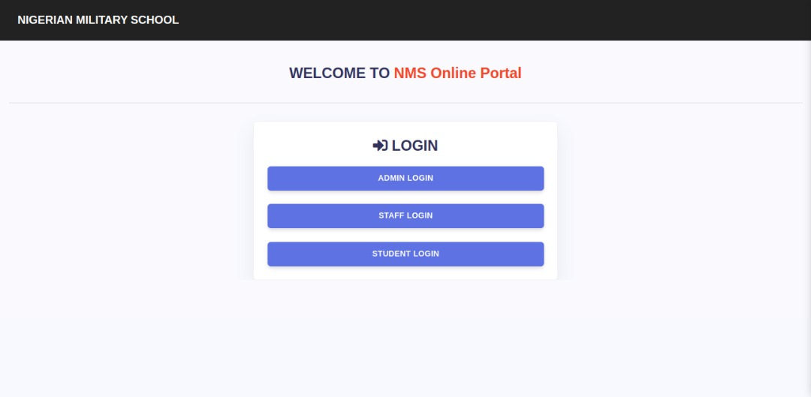
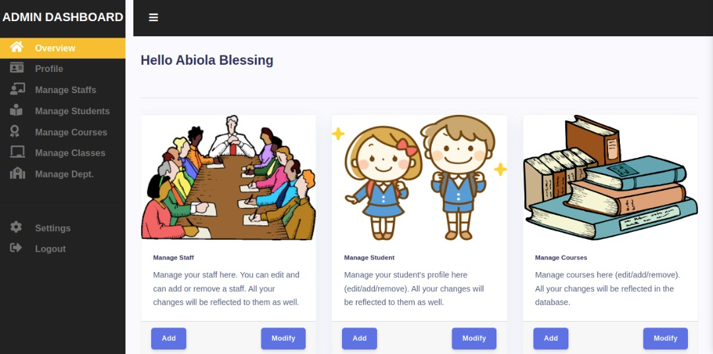
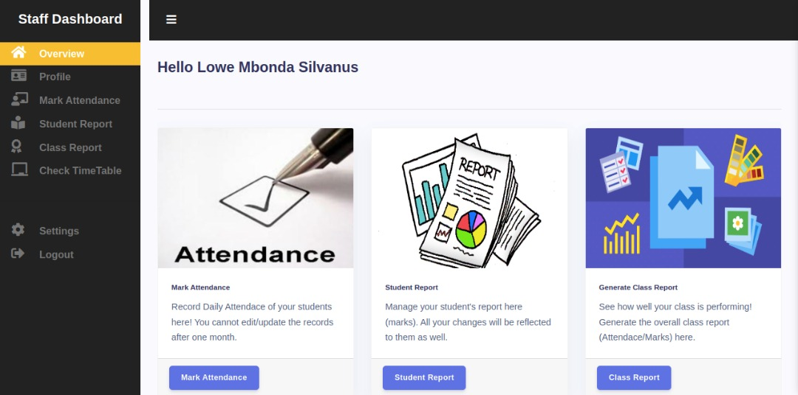
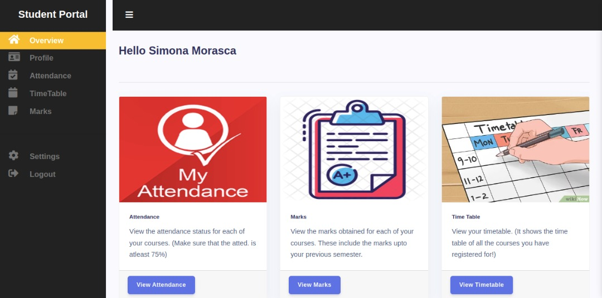

# Information-management-system

## Table of contents

- [Overview](#overview)
  - [The Objective](#the-objective)
  - [Screenshot](#screenshot)
  - [Links](#links)
- [How to run app locally](#how-to-run-app-locally)
- [My process](#my-process)
  - [Built with](#built-with)
  - [Immediate Future Improvements](#immediate-future-improvements)
- [Author](#author)

## Overview

## How to run app locally

```
Clone repository using git clone https://github.com/Abilicon/Information-management-system 
Cd into the project folder to enter into the project folder
Open folder in code editor
Run npm install to install application dependencies
Open MySQL workbench and run CREATE DATABASE cumsdbms; to create a database
Create tables using the SQL script file in project folder/databse/cms.sql;
Go back to the code editor and create an env file in the project root folder, with the following environment variables
```
    - DB_HOST
    - DB_USER
    - DB_PASS
    - JWT_SECRET
    - JWT_EXPIRE
    - SESSION_SECRET
- To set up mail gun go to the mail gun official documentation
    - MAILGUN_API_KEY
    - RESET_PASSWORD_KEY
    - URL
    - DOMAINE_NAME
```
To seed data in the database run to file in project folder/documents/seed/seed.js folder
To generate the timetable, run the file in the project folder/documents/timetable.js.
To start the application run npm start

```

### The Objective

Users should be able to:

- Admin
    - login/logout
    - Add staff/student/course record
    - View staff/student/course record
    - Delete staff/student/course record
    - Search staff/student/course record
    - Generate timetable based on available course record
- Student
    - login/logout
    - view timetable/depatement/marks/personal information
    - upload solution
- Staff
    - login/logout
    - view timetable/depatement/marks/personal information
    - add student marks
    - upload assignment

Course
Department
Login
This system will also include certain features such as
Authentication
Role-based access level
CRUD functionality for the different entities

### Screenshot






### Links

- Failed Heroku deployment: [https://tranquil-biscayne-12886.herokuapp.com/](hhttps://tranquil-biscayne-12886.herokuapp.com/)

## My process

### Built with

- Semantic HTML markup
- CSS
- [NodeJs](https://nodejs.org/en/) - Javascript runtime environment
- [Express.js](https://expressjs.com/) - Backend framework
- [MySQL workbench](https://www.mysql.com/products/workbench/) - Database management software


### Immediate Future Improvements

- Add timetable generation feature to the admin dashboard
- Add active states on NavLink
- Fix add student bug

## Author

Abiola Akinsowon
